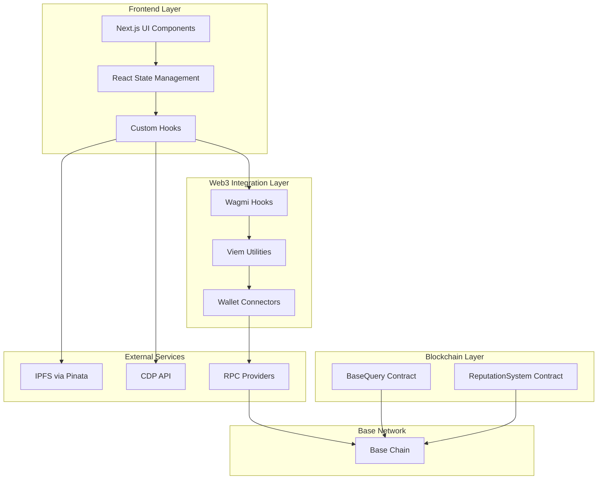

# Base Query - Decentralized Q&A Platform on Base

A decentralized Q&A platform built on Base blockchain with reputation-based governance and economic incentives using USDC.

## Contract Addresses

- **ReputationSystem**: [`0xeA8e3e5872E90E6437e6D836dEF8334f49F9e73f`](https://sepolia.basescan.org/address/0xeA8e3e5872E90E6437e6D836dEF8334f49F9e73f)
- **BaseQuery**: [`0x37c98fC6109a79A2e6ade5719213f526D346B033`](https://sepolia.basescan.org/address/0x37c98fC6109a79A2e6ade5719213f526D346B033)

## Architecture Overview

The system consists of three main smart contracts:

- **`ReputationSystem.sol`**: Manages user reputation scores and voting mechanics
- **`BaseQuery.sol`**: Main platform logic for questions, answers, and rewards
- **`MockUSDC.sol`**: Mock USDC contract for local testing

## Core Features

### Question Types
- **Bounty Questions**: Manual selection of best answer with immediate reward
- **Prize Pool Questions**: Automatic distribution based on community voting

### Reputation System
- Users gain reputation for asking questions (+1) and answering (+1)
- Best answers receive +10 reputation bonus
- Voting affects reputation: upvotes (+2), downvotes (-1)

### Anti-Spam Mechanisms
- Minimum 0.001 ETH balance required to answer or vote
- One answer per question per user
- No self-voting allowed
- No double voting on same content

### Reward Distribution
- **Bounty Questions**: 98% to winner, 2% platform fee
- **Pool Questions**: Weighted distribution based on vote scores (upvotes - downvotes)
  - Only answers with positive scores receive rewards
  - Distribution is proportional to individual answer scores
  - Maximum 3 winners per pool question

## Frontend Integration Architecture



## Setup & Installation

### Prerequisites
- [Foundry](https://getfoundry.sh/) installed
- Git
- Node.js (for additional tooling)

### Installation
```bash
# Clone the repository
git clone <your-repo-url>
cd Base-Query

# Install dependencies
forge install

# Copy environment file
cp env.example .env
# Edit .env with your private key and configuration
```

### Environment Configuration
Create a `.env` file with:
```bash
PRIVATE_KEY=your_private_key_here
BASE_SEPOLIA_RPC=https://sepolia.base.org
```

## Testing

### Run All Tests
```bash
forge test
```

### Run Specific Test
```bash
forge test --match-test test_CreateBountyQuestion
```

### Run Tests with Verbose Output
```bash
forge test -vvv
```

### Test Coverage
```bash
forge coverage
```

## Deployment

### Local Testing
```bash
# Build contracts
forge build

# Run tests
forge test
```

### Base Sepolia Testnet
```bash
# Set your private key
export PRIVATE_KEY=your_private_key_here

# Deploy to Base Sepolia
forge script script/Deploy.s.sol:DeployScript --rpc-url https://sepolia.base.org --broadcast --verify
```

### Mainnet Deployment
```bash
# Deploy to Base mainnet
forge script script/Deploy.s.sol:DeployScript --rpc-url https://mainnet.base.org --broadcast --verify
```

## Contract Functions

### BaseQuery Contract
- `createQuestion(ipfsHash, bountyAmount, poolDuration, useAsPool)`: Create new question
- `submitAnswer(questionId, ipfsHash)`: Submit answer to question
- `selectBestAnswer(questionId, answerId)`: Select best answer (bounty questions)
- `distributePool(questionId)`: Distribute prize pool (pool questions)
- `vote(questionId, answerId, contentType, isUpvote)`: Vote on content
- `increaseBounty(questionId, additionalAmount)`: Increase question bounty
- `withdrawPool(questionId)`: Withdraw pool if no good answers
- `withdrawBounty(questionId)`: Withdraw bounty if no answers submitted

### ReputationSystem Contract
- `canAnswer(address user)`: Check if user can answer
- `canVote(address user)`: Check if user can vote
- `vote(questionId, answerId, contentType, isUpvote, contentOwner, voter)`: Cast vote
- `updateReputation(address user, int256 change)`: Update user reputation
- `getUserReputation(address user)`: Get user reputation score
- `getVoteCount(questionId, answerId, contentType)`: Get vote counts for content

## Frontend Integration

### Web3 Setup
```typescript
// wagmi configuration for Base
import { createConfig, configureChains } from 'wagmi';
import { baseSepolia } from 'wagmi/chains';
import { publicProvider } from 'wagmi/providers/public';
import { MetaMaskConnector } from 'wagmi/connectors/metaMask';

const { chains, publicClient, webSocketPublicClient } = configureChains(
  [baseSepolia],
  [publicProvider()]
);

export const config = createConfig({
  autoConnect: true,
  connectors: [new MetaMaskConnector({ chains })],
  publicClient,
  webSocketPublicClient,
});
```

### Contract Integration
```typescript
// Contract hooks using wagmi
import { useContractRead, useContractWrite, usePrepareContractWrite } from 'wagmi';

export function useCreateQuestion() {
  const { config } = usePrepareContractWrite({
    address: STACK_EXCHANGE_ADDRESS,
    abi: STACK_EXCHANGE_ABI,
    functionName: 'createQuestion',
  });
  
  return useContractWrite(config);
}
```

### IPFS Integration
```typescript
// IPFS upload using Pinata
import { create } from '@pinata/sdk';

const pinata = create({
  pinataApiKey: process.env.NEXT_PUBLIC_PINATA_API_KEY!,
  pinataSecretApiKey: process.env.PINATA_SECRET_API_KEY!,
});

export async function uploadToIPFS(content: any) {
  const result = await pinata.pinJSONToIPFS(content);
  return result.IpfsHash;
}
```

## Test Scenarios

The test suite covers:
- Question creation (bounty and pool)
- Answer submission
- Voting system
- Reputation updates
- Bounty distribution
- Pool distribution based on vote scores
- Error conditions
- Anti-spam mechanisms

## Security Features

- Reentrancy protection
- Access control modifiers
- Input validation
- Safe math operations
- Platform fee collection
- ETH balance requirements
- Vote validation and anti-gaming measures

## Gas Optimization

- Efficient storage patterns
- Minimal external calls
- Optimized loops
- Batch operations where possible

## Important Notes

1. **USDC Decimals**: The system uses 6 decimal places for USDC
2. **ETH Balance**: Users need minimum 0.001 ETH to participate
3. **Platform Fees**: 2% fee on all transactions
4. **Time Locks**: Pool questions have configurable time limits
5. **Authorization**: Only authorized contracts can update reputation
6. **Vote-Based Rewards**: Pool question rewards are distributed based on community voting scores

## Contributing

1. Fork the repository
2. Create a feature branch
3. Make your changes
4. Add tests for new functionality
5. Submit a pull request


## Future Enhancements

- Multi-token support
- Advanced reputation algorithms
- Governance mechanisms
- Social features
